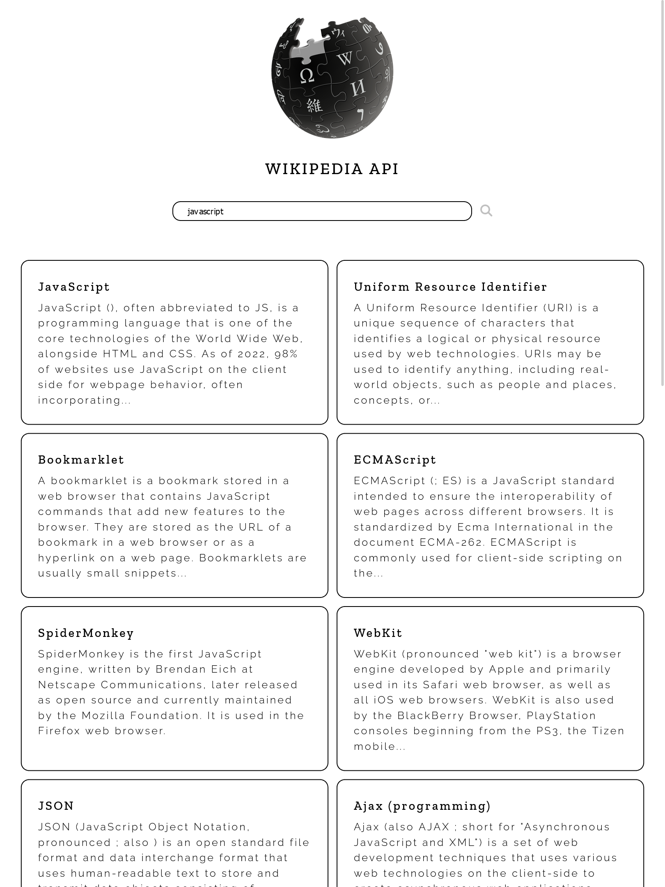

# Wikipedia API

---

<div>
<a href="https://www.mediawiki.org/wiki/API:Main_page" target="_blank" rel="noopener noreferrer"
    style="padding:0.35rem 0.7rem;
    color: black;
    background: #F1DEDE;
    border-radius:10px;
    font-size:0.85rem;
    font-weight:600;">Official API Docs</a> 
</div>

---
## Tech stack

```
Core:
- HTML
- SASS/SCSS
- JavaScript ES6

Communication tool:
- Axios
```


### Preview

